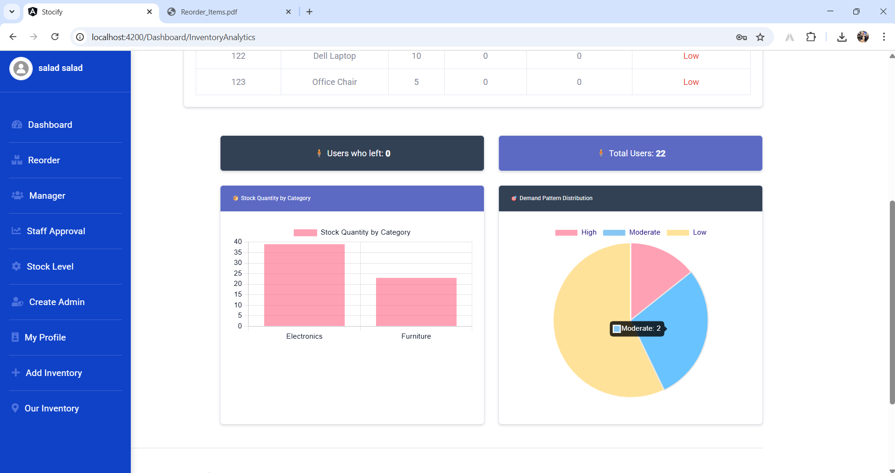

# 📦 Stockify - Inventory Management System (Angular)

**Stockify** is a smart and simple Inventory Management Dashboard developed using **Angular**. It helps businesses monitor, manage, and reorder stock across multiple locations with confidence. This project includes comprehensive stock analytics, user management, and geographic inventory mapping.

---

## 🌟 Features Overview

### 🧾 Inventory Analytics Dashboard
- Real-time inventory insights: stock levels, total sold, turnover rate.
- Demand pattern classification (Low, Moderate, High).
- Summary charts:
  - 📊 **Stock Quantity by Category**
  - 🥧 **Demand Pattern Distribution**

### 🔁 Reorder Management
- Automatically check items against threshold quantity.
- Manual override with `>` or `<` conditions.
- One-click export as PDF (`html2pdf.pdf`).

### 🧑‍💼 User & Staff Approval
- Admin can:
  - Create managers or admins.
  - View pending users, approve or reject them.
  - Activate/deactivate users.

### 🛒 Stock Level Management
- Add stock items with:
  - Product name, category, barcode, quantity, supplier, inventory.
  - PDF export.

### 🧍 My Profile & Account Management
- Update profile info (name, phone, password, image).
- Delete your account securely.

### 📦 Inventory Addition & Mapping
- Add new inventory locations.
- Assign suppliers and types.
- Visual location mapping with **Google Maps API**.

---

## 🔧 Technologies Used

| Layer           | Tech Stack                         |
|----------------|-------------------------------------|
| Frontend       | Angular 16+, TypeScript             |
| Styling        | Bootstrap, SCSS, Custom Components  |
| Charts         | Chart.js via ng2-charts             |
| PDF Generation | html2canvas + jsPDF                 |
| Maps           | Google Maps JavaScript API          |
| DB & Backend   | Oracle DB (class diagram shown), .NET Core API|

---

## 📸 Screenshots

## 📈 Dashboard
  
 
 

 ## 👤 Users
 
   
   
 

 ## 🏢 Create 
    
    
  
 ## 🗺️ Inventory Location Map
   

More Screens:
- [x] Update Profile  
  
- [x] Reordering  
  
  

- [x] Class diagram 
  

> 📂 You can see the rest of the pages in  `src/assets/screenshot/` 

---

## 🧠 What I Worked On

✅ Created the full Angular frontend  
✅ Designed reusable components for dashboard, modals, and tables  
✅ Integrated Google Maps for location-based inventory  
✅ Implemented:
- CRUD for users, inventory, products
- Role-based access
- Reorder logic
- Charts and stats visualization  
✅ Created exportable PDF reports  
✅ Designed responsive UI and styled using SCSS/Bootstrap  
✅ Built database structure in Oracle (see class diagram)

---
## 🔐 Authentication & Authorization

- Login system with **Role-Based Access Control (RBAC)**.
- User roles include:
  - `Admin` – Full access.
  - `Manager` - it will be in mobile app
  - `Staff`- it will be in mobile app
- Token-based session handling ( integration with backend JWT API).

---
## 🚀 How to Run Locally

```bash
# Clone the repo
git clone https://github.com/your-username/stockify-angular.git
cd stockify-angular

# Install dependencies
npm install

# Start the development server
ng serve --open
